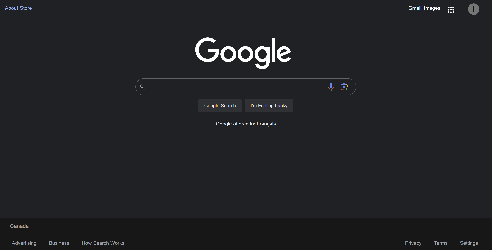
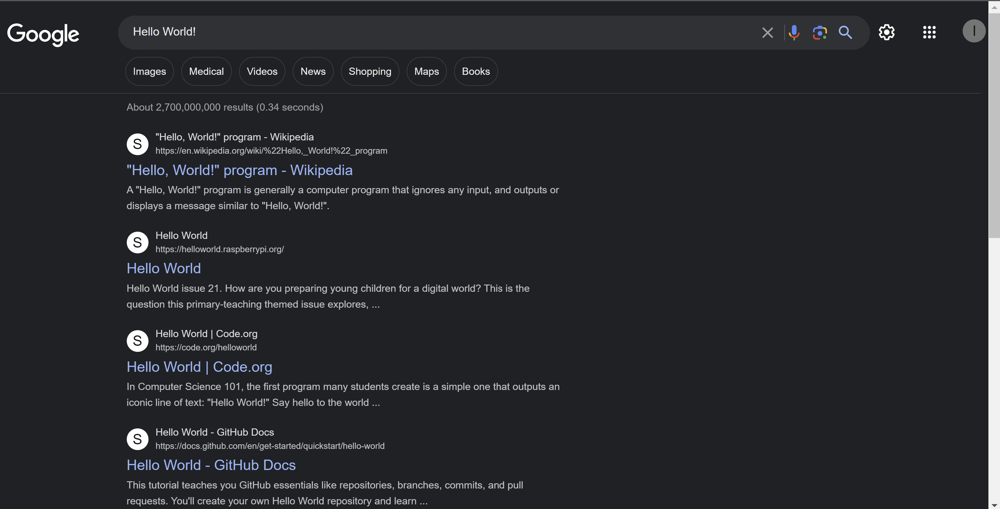

# Google Clone

A clone of the Google search engine, built using React and Google's Custom Search API.

## Demo

Start page

Search page

## Table of Contents

- [Installation](#installation)
- [Technologies Used](#technologies-used)
- [Usage](#usage)

## Installation

1. Clone the repository: `git clone https://github.com/Ishancorp/google-clone.git`
2. Navigate to the project directory: `cd google-clone`
3. Install basic React libraries to the same directory
4. Run `npm run start` inside the google-clone directory

## Technologies Used

- React for structuring the content and interactivity.
- CSS3 for styling and layout.
- JavaScript for interactivity and search functionality.

## Usage

Simply enter your search query in the search bar and hit "Enter" or click the "Google Search" button to perform a search.

